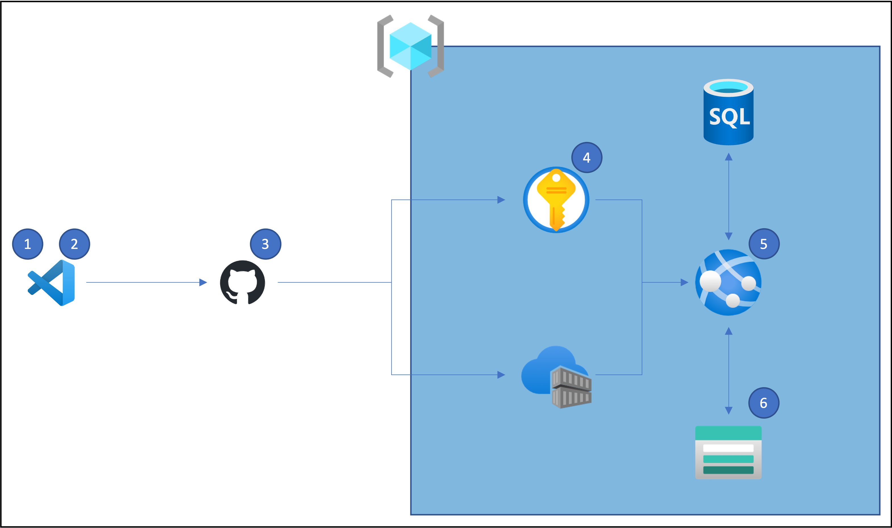

# Django on Azure Template

This template automates the deployment of a Django project to Azure through custom management commands, Terraform, and GitHub Actions.  The architecture diagram below details the resources deployed to Azure and the overall deployment flow.



1. A Visual Studio Code Devcontainer provides a fully-featured development environment and wraps all dependencies.

1. The custom `bootstrap` Django management command creates the required resources to remotely store Terraform state in Azure and creates secrets in the GitHub repository that enable the deployment and configuration of production resources by GitHub Actions.  The command only needs to be run once, directly after the repo is cloned.

1. Any push to `main` triggers a GitHub Action that manages Azure resources with Terraform, migrates the production database to an Azure SQL Database, collects the static files to a Storage Account, builds the production Docker image, and pushes that image to an Azure Container Registry.  On the initial push to `main`, Terraform creates and configures the required resources in Azure.  On sub-sequent pushes, Terraform manages any changes to the Azure resources made in [tf/main.tf](./tf/main.tf).

1. Secrets required by Azure resources and GitHub Actions are managed in an Azure Key Vault.

1. The continuous deployment capability in the App Service pulls the production container from the Azure Container Registry each time it is updated through the GitHub Action.

1. Static files are stored and served by an Azure Storage Account.

## Getting Started

The quick tutorial below will get you started with the Django on Azure template.

### Install Client Dependencies and Collect Resources

The following client applications and resources are required to use this template.

- [Visual Studio Code](https://code.visualstudio.com/download)
- [Dev Containers Extension](https://marketplace.visualstudio.com/items?itemName=ms-vscode-remote.remote-containers)
- [Docker](https://www.docker.com/products/docker-desktop/)
- [Azure Subcription ID](https://learn.microsoft.com/en-us/azure/azure-portal/get-subscription-tenant-id)

If you do not want to use the dev container, please see [Manual Dev Environment](#manual-dev-environment) below.

### Create a Repository from the Django on Azure Template

Create a new repository from this template by clicking the "Use this template" button in GitHub (above).

Clone the new repo you created from this template to your client.  GitHub provides the "<> Code" button for copy/paste commands.

Open the folder containing the new project in Visual Studio Code with `File -> Open Folder...`.

You should receive a prompt from VS Code after opening the folder to re-open the project in its dev container.  If you do not receive the prompt, use the green `><` button in the bottom-left of the VS Code window and select `Re-open in Container`.

### Use the Custom Django Management Commands

Once the dev container starts, run the `bootstrap` Django management command as below.  The command is interactive.  You will need a project name, Azure Subscription ID, Azure Region (default provided), Superuser Username, and Superuser Password.  The command will also interactively log you in to Azure and GitHub.  Once complete, `bootstrap` will have renamed project files and folders, created Azure resources to remotely store the Terraform state, and created secrets in GitHub for later use by GitHub Actions.

```bash

python manage.py bootstrap

```

At this time, you can also setup your dev environment by running the `create_dev_env` management command.  This command will create a `dev.env` file at the project root for use by the `dev.py` settings file.  Once `dev.env` is created you can migrate and run the development server locally.

```bash

python manage.py create_dev_env

```

### Push the Updated Repo to GitHub

Once the `bootstrap` command is complete, commit and push the changes to the GitHub repo as below.  This will trigger a GitHub Action that will create and configure the required Azure resources with Terraform and build/deploy your Django project.

```bash

git add -A
git commit -m "Ran Bootstrap Command"
git push

```

### Verify Deployment

You can check on the status of the GitHub Action by visiting your GitHub repo and selecting Actions in the top bar.  On the initial push, it will take several minutes for the GitHub Action to complete because the Azure resources need to be created.  On subsequent pushes to `main`, Terraform will only make changes reflected in [tf/main.tf](./tf/main.tf).

Once the GitHub Action successfully completes, navigate to the Azure Portal and find your App Service.  Find its domain on the Overview page and open it in a new browser tab.  Your App Service may show an application error initially.  Don't worry, it can take several minutes after the GitHub Action completes for App Service to pull your container image from the Azure Container Registry.  Once complete, you will see the Django :heart: Azure demo page.

### Develop Your Project

At this point, you can start developing your project.  Happy hacking!  Remember, using best practices for infrastructure-as-code, any changes to Azure resources should be made in [tf/main.tf](./tf/main.tf) or Terraform modules and not directly in the Azure Portal.  In addition, remember that the GitHub Action will verify the project is using `production.py` for settings, migrate the production database, collect static files, build the container image, and deploy to the Azure Container Registry.  Make any required changes in code and not directly on the production resources.

## Terraform Variables

In future iterations, this project will be updated with Terraform variables to change attributes of the resources without updating [tf/main.tf](./tf/main.tf).

## Manual Dev Environment

If you do not want to use Docker and the dev container, the following applications are required on the client.

- [Azure CLI](https://learn.microsoft.com/en-us/cli/azure/install-azure-cli)
- [Git](https://git-scm.com/book/en/v2/Getting-Started-Installing-Git)
- [GitHub CLI](https://cli.github.com/manual/installation)
- [Terraform](https://developer.hashicorp.com/terraform/tutorials/aws-get-started/install-cli)

## License

[GNU General Public License v3.0](https://choosealicense.com/licenses/gpl-3.0/)