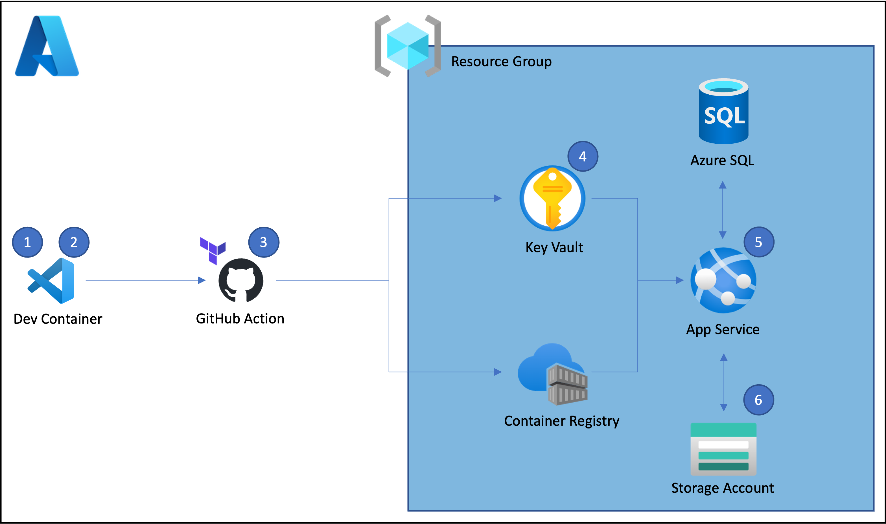

# Django on Azure Template

This template automates the deployment of a Django application to Azure through custom management commands, Terraform, and GitHub Actions.  The architecture diagram below details the resources deployed to Azure and the overall deployment flow.



1. A Visual Studio Code Devcontainer provides a fully-featured development environment and wraps all dependencies.

1. The custom `bootstrap` Django management command creates the required resources to remotely store Terraform state in Azure and creates secrets in the GitHub repository that enable the deployment and configuration of production resources by GitHub Actions.  The command only needs to be run once, directly after the repo is cloned.

1. Any push to `main` triggers a GitHub Action that manages Azure resources with Terraform, migrates the production database to an Azure SQL Database, collects the static files to a Storage Account, builds the production Docker image, and pushes that image to an Azure Container Registry.  On the initial push to `main`, Terraform creates and configures the required resources in Azure.  On sub-sequent pushes, Terraform manages any changes to the Azure resources made in [tf/main.tf](./tf/main.tf).

1. Secrets required by Azure resources and GitHub Actions are managed in an Azure Key Vault.

1. The continuous deployment capability in the App Service pulls the production container from the Azure Container Registry each time it is updated through the GitHub Action.

1. Static files are stored and served by an Azure Storage Account.

## Getting Started

The basic flow for getting started with this template is detailed below.

### Install Dependencies

The following applications are required to use this template.

- [Visual Studio Code](https://code.visualstudio.com/download)
- [Dev Containers Extension](https://marketplace.visualstudio.com/items?itemName=ms-vscode-remote.remote-containers)
- [Docker](https://www.docker.com/products/docker-desktop/)
- [Azure Subcription ID](https://learn.microsoft.com/en-us/azure/azure-portal/get-subscription-tenant-id)

If you do not want to use the dev container, please see [Manual Dev Environment](#manual-dev-environment) below.

### Create a Repository from the Django on Azure Template

Create a new repository from this template by clicking the "Use this template" button in GitHub (above).

Clone the new repo you created from the template to your client.  GitHub provides the "<> Code" button or you can learn at [Cloning a Repository](https://docs.github.com/en/repositories/creating-and-managing-repositories/cloning-a-repository).

Open the folder containing the new project in Visual Studio Code with `File -> Open Folder...`.

You should receive a prompt from VS Code after opening the folder to re-open the project in its dev container.  If you do not receive the prompt, use the green `><` button in the bottom-left of the VS Code window and select `Re-open in Container`.

### Use the Custome Management Commands

Once the dev container starts, run the `bootstrap` Django management command as below.  The command is interactive.  You will need a project name, Azure Subscription ID, Azure Region (default provided), Superuser Username, and Superuser Password.  The command will also interactively log you in to Azure and GitHub.  The command will rename project files and folders, create Azure resources to remotely store the Terraform state, and create secrets in GitHub for use by GitHub Actions.

```bash

python manage.py bootstrap

```


## Terraform Variables

## Manual Dev Environment

## Contributing

## License